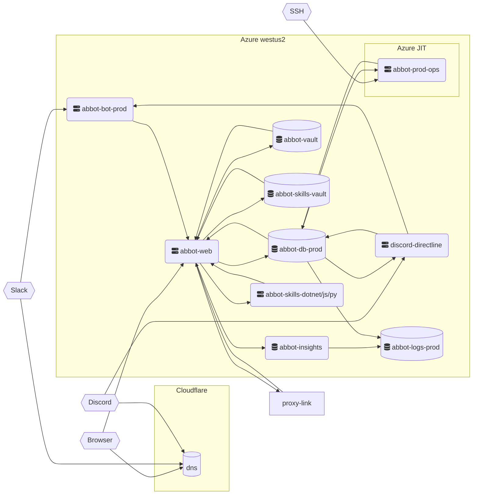

# Network Topology

Abbot uses a simple public network model, we do not use private network links at this time.

All our resources are contained in the Azure West US 2 region, with the exception of any global resources like DNS services.

Our DNS is provided by [Cloudflare](https://cloudflare.com). We do not currently use the "proxy" feature, so once Domain Names are resolved to IPs, Cloudflare is no longer involved in network traffic.

Our resources are accessible on public networks, but are protected by several network-level protection mechanisms:

* Database servers are protected by a firewall that allows **only** our specific Web Server IP addresses, and production operations VM through.
* The production operations VM is protected by Azure Just-In-Time (JIT) access, which requires that an authorized Azure user request short-term access to the VM for a specific range of IPs. This access is automatically terminated after 3 hours.

In no circumstance do we consider network access sufficient for authentication. After a network connection is estalished to a resource, we still require authentication using a shared key or other security mechanism.

## Diagram

Here is a rough diagram of our network topology in production. It is dynamically generated using [MermaidJS](https://mermaid-js.github.io/). The hexagonal boxes represent our external consumers (Discord, Slack, Web Browsers, SSH from operators)

